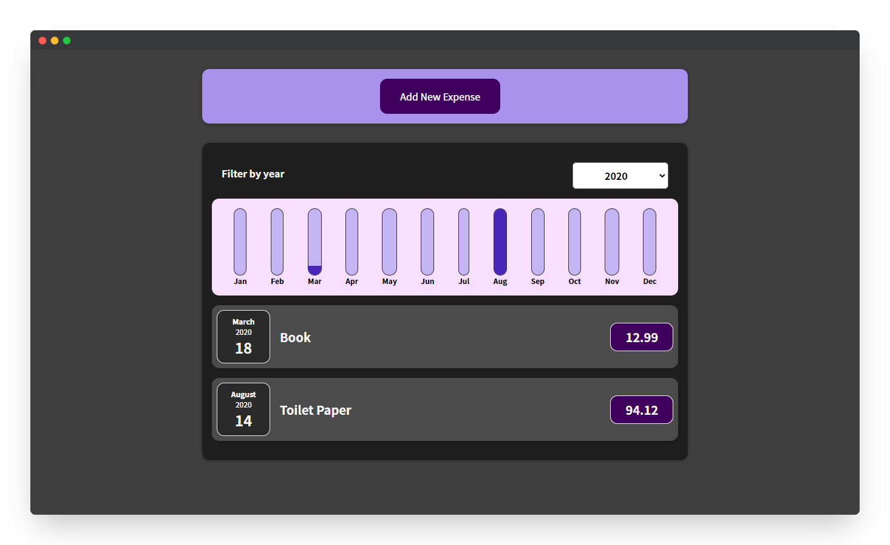
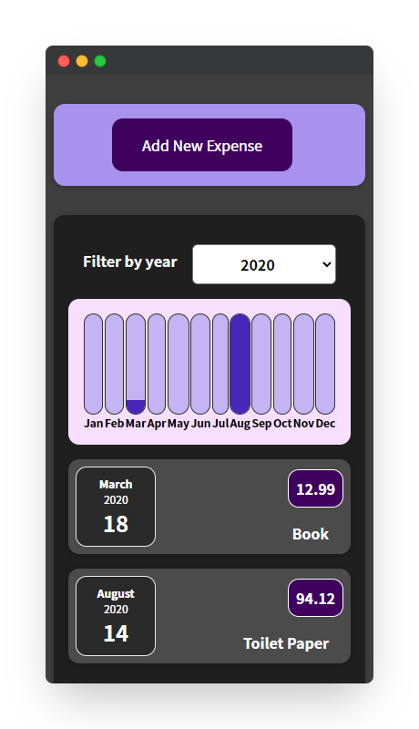
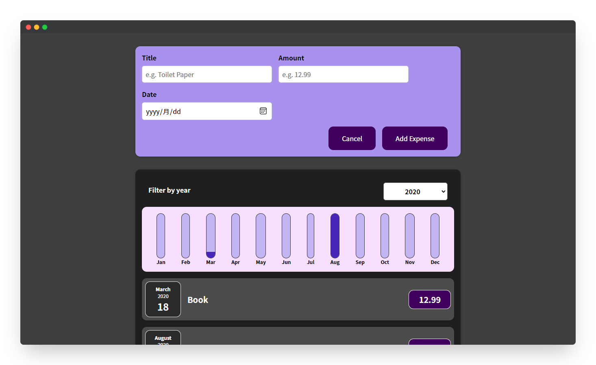
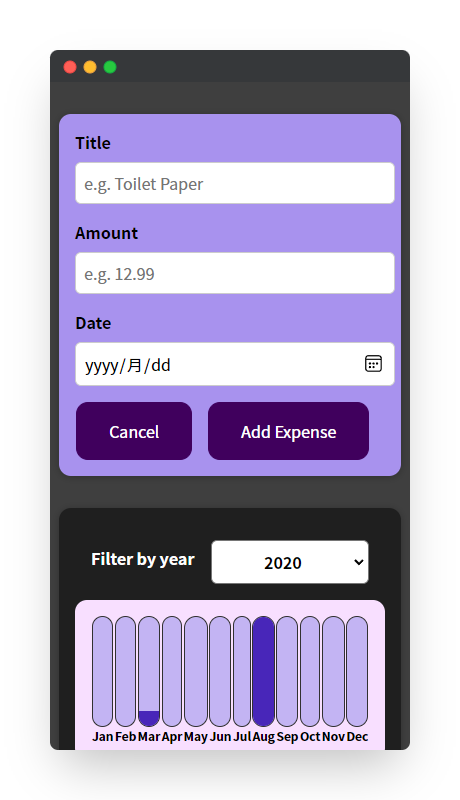

<!--
*** Thanks for checking out the react-bookkeeping. If you have a suggestion
*** that would make this better, please fork the repo and create a pull request
*** or simply open an issue with the tag "enhancement".
*** Thanks again! Now go create something AMAZING! :D
***
*** To avoid retyping too much info. Do a search and replace for the following:
*** github_username (that is "windsuzu"), repo_name (that is "react-bookkeeping"), project_title, project_description
-->

<!-- [![Issues][issues-shield]][issues-url] -->
<!-- [![PR Welcome][pr-welcome-shield]](#contributing) -->
[![Contributors][contributors-shield]][contributors-url]
[![MIT License][license-shield]][license-url]
[![Author][author-shield]][author-url]
[![LinkedIn][linkedin-shield]][linkedin-url]

<!-- PROJECT LOGO -->
 

  

  <h3 align="center">React Bookkeeping</h3>

  

    A bookkeeping application built with react.js. 
     
    <a href="https://windsuzu.github.io/react-bookkeeping">View Demo</a>
    ·
    <a href="https://github.com/windsuzu/react-bookkeeping/issues">Report Bug</a>
    ·
    <a href="https://github.com/windsuzu/react-bookkeeping/issues">Request Feature</a>
  

Table of Contents

* [About](#about)
* [Examples](#examples)
  * [**⚙️ JSX Components**](#️-jsx-components)
  * [**🚥 State and Event**](#-state-and-event)
  * [**💪 Flexible design**](#-flexible-design)
* [Preview](#preview)
* [License](#license)
* [Contact](#contact)
* [Acknowledgements](#acknowledgements)

---

<!-- ABOUT THE PROJECT -->
## About

<table>
<tr>
<td>

**React BookKeeping** 展示 react.js 的基本核心概念。主要可以分為三個方向：

1. JSX component 的相關概念
   * 例如 `props`, `styling`, `composition`
2. State 和 Event 的相關概念
   * 例如 `useState`, `eventHandler`, `two-way binding`, `bottom-up communication`, `state lifting`
3. 彈性化設計的相關概念
   * 例如 `stateful list`, `conditional content`, `dynamic styles`

**Built With**

* HTML5, CSS3, Javascript ES6
* React.js

**[DEMO]** : https://windsuzu.github.io/react-bookkeeping

</td>
</tr>
</table>

---

## Examples

### **⚙️ JSX Components**

- **Props** e.g. [[parent component]](https://github.com/windsuzu/react-bookkeeping/blob/main/src/components/Expenses/ExpensesList.js#L13-L18) [[child component]](https://github.com/windsuzu/react-bookkeeping/blob/main/src/components/Expenses/ExpenseItem.js#L6-L18)
- **Global Styling** e.g. [[stylesheet]](https://github.com/windsuzu/react-bookkeeping/blob/main/src/components/Expenses/Expenses.css#L1-L8) [[import]](https://github.com/windsuzu/react-bookkeeping/blob/main/src/components/Expenses/Expenses.js#L6)
- **Composition** e.g. [[Expenses.js]](https://github.com/windsuzu/react-bookkeeping/blob/main/src/components/Expenses/Expenses.js#L21-L28)
- **Wrapper Component** e.g. [[Card.js]](https://github.com/windsuzu/react-bookkeeping/blob/main/src/components/UI/Card.js#L4-L6)

### **🚥 State and Event**

- **useState** e.g. [[filteredYear]](https://github.com/windsuzu/react-bookkeeping/blob/main/src/components/Expenses/Expenses.js#L9)
- **EventHandler** e.g. [[filterChangeHandler]](https://github.com/windsuzu/react-bookkeeping/blob/main/src/components/Expenses/ExpensesFilter.js#L5)
- **Bottom-up Communication** e.g. [[parent component]](https://github.com/windsuzu/react-bookkeeping/blob/main/src/components/Expenses/Expenses.js#L24) [[child component]](https://github.com/windsuzu/react-bookkeeping/blob/main/src/components/Expenses/ExpensesFilter.js#L5)
- **Two-way Binding** e.g. [[ExpensesFilter]](https://github.com/windsuzu/react-bookkeeping/blob/main/src/components/Expenses/Expenses.js#L22-L25)
- **State Lifting** e.g. [[add new expense]](https://github.com/windsuzu/react-bookkeeping/blob/main/src/App.js#L33-L44)

### **💪 Flexible design**

- **List Rendering** e.g. [[expenses list]](https://github.com/windsuzu/react-bookkeeping/blob/main/src/components/Expenses/ExpensesList.js#L12-L19)
- **Conditional Content** e.g. [[new expense panel]](https://github.com/windsuzu/react-bookkeeping/blob/main/src/components/NewExpense/NewExpense.js#L21-L35)
- **Dynamic Styles** e.g. [[chart bar]](https://github.com/windsuzu/react-bookkeeping/blob/main/src/components/Chart/ChartBar.js#L5-L16)

## Preview

  
  

  
  

## License

Distributed under the MIT License. See [LICENSE](https://github.com/windsuzu/react-bookkeeping/blob/main/LICENSE) for more information.

## Contact

Reach out to the maintainer at one of the following places:

* [GitHub discussions](https://github.com/windsuzu/react-bookkeeping/discussions)
* The email which is located [in GitHub profile](https://github.com/windsuzu)

## Acknowledgements

* [Maximilian Schwarzmüller](https://www.udemy.com/user/maximilian-schwarzmuller/)

[contributors-shield]: https://img.shields.io/github/contributors/windsuzu/react-bookkeeping.svg?style=for-the-badge
[contributors-url]: https://github.com/windsuzu/react-bookkeeping/graphs/contributors
[issues-shield]: https://img.shields.io/github/issues/windsuzu/react-bookkeeping.svg?style=for-the-badge
[issues-url]: https://github.com/windsuzu/react-bookkeeping/issues
[license-shield]: https://img.shields.io/github/license/windsuzu/react-bookkeeping.svg?style=for-the-badge&label=license
[license-url]: https://github.com/windsuzu/react-bookkeeping/blob/main/LICENSE
[linkedin-shield]: https://img.shields.io/badge/-LinkedIn-black.svg?style=for-the-badge&logo=linkedin&colorB=555
[linkedin-url]: https://linkedin.com/in/windsuzu
[pr-welcome-shield]: https://shields.io/badge/PRs-Welcome-ff69b4?style=for-the-badge
[author-shield]: https://shields.io/badge/Made_with_%E2%9D%A4_by-windsuzu-F4A92F?style=for-the-badge
[author-url]: https://github.com/windsuzu
